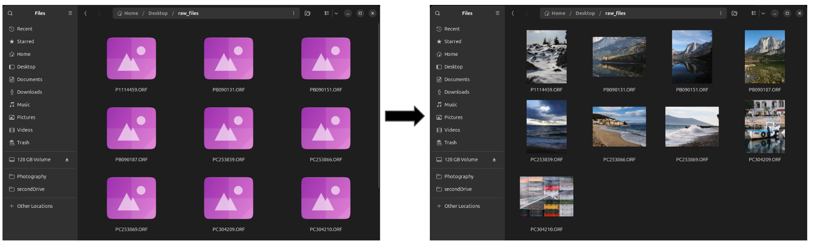

# Nautilus Thumbnailer for RAW Previews 

A lightweight and fast thumbnailer for Nautilus that generates thumbnails for RAW image files using embedded previews extracted with exiv2.
This thumbnailer should work with most RAW formats that have embedded previews.

Tested on Ubuntu 24.04 with Nautilus (GNOME Files). Should work also with  Nemo and Caja.

<picture style="align: center; padding-bottom: 3mm;">
  
</picture>

##  Installation

```bash
# close the repo and move to the folder containing the scripts
git clone https://github.com/emuskardin/nautilus-raw-thumbnails.git
cd nautilus-raw-thumbnails

# install dependencies
# For Debian/Ubuntu
sudo apt install exiv2 imagemagick libimage-exiftool-perl
# For Fedora
# sudo dnf install exiv2 ImageMagick perl-Image-ExifTool

# Move the thumbnailer configuration to the system directory
sudo cp exiv2raw.thumbnailer /usr/share/thumbnailers/

# Move the thumbnailer script to the bin directory and make it executable
sudo cp exiv2-thumbnailer.sh /usr/local/bin/
sudo chmod +x /usr/local/bin/exiv2-thumbnailer.sh

# Restart Nautilus to apply the changes:
nautilus -q

# Optional (force thumbnail generation)
rm -rf ~/.cache/thumbnails/*
```

If thumbnails are not generated, check that mime type of your RAW files is contained in exiv2raw.thumbnailer.

If you have already tried this solution (that does not work on Ubuntu 20 and 24) where you [add mime types to gdk-pixbuf-thumbnailer.thumbnailer](https://askubuntu.com/questions/283072/nautilus-isnt-displaying-thumbnails-for-my-nef-files-photo-raw) (second answer), you might want to remove them from there. I am not sure if this will cause issues with order of thumbnailsers. 

## Troubleshooting

If you're having issues with the thumbnailer, try these debugging steps:

1. Reset Nautilus and clear the thumbnail cache:
```bash
nautilus -q
rm -rf ~/.cache/thumbnails/*
```

2. Launch Nautilus with debugging enabled:
```bash
G_MESSAGES_DEBUG=all NAUTILUS_DEBUG=Window nautilus
```

3. Check if the script can extract thumbnails manually:
```bash
/usr/local/bin/exiv2-thumbnailer.sh /path/to/your/file.RAW /tmp/test-thumbnail.png
```

4. Verify that your RAW files have embedded previews:
```bash
exiv2 -pp /path/to/your/file.RAW
```

#### Tested Formats

Working
- .ORF, .ARW, .NEF, .RAF, .CR2, .CR3, DNG

WIP
- RW2